# Teoriden Üretime:
### Makine Öğrenmesi Mühendisliği

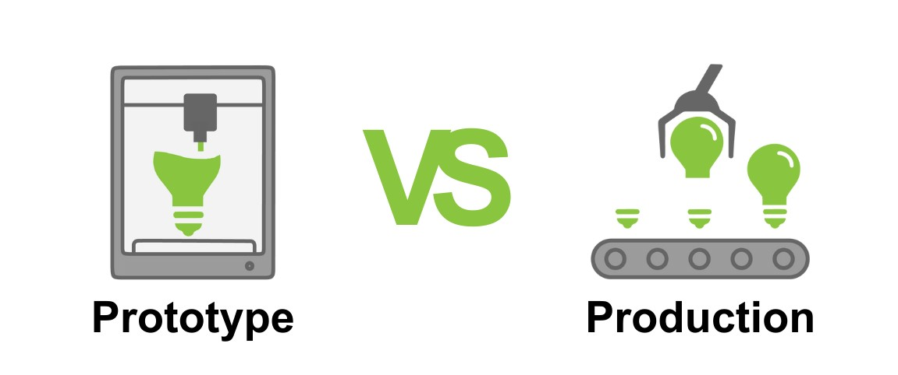

---

## İçindekiler

1. **Problemi Anlamak**
2. **Veriyi Anlamak**
3. **Model Seçimi ve Tasarımı**
4. **Prototipten Prodüksiyona**
5. **Model ve Veri Takibi**
6. **Kariyer Tavsiyeleri**

---

## Hakkımda

- **Eğitim:** İstanbul Üniversitesi - Fizik (Lisans & Yüksek Lisans)
* **Rol:** MLOps Mühendisi @ Teknasyon
* **Ana Yetkinlikler:** Python, Linux/Bash, Git, Sistem Mimarisi
* **Gizli Silahım:** Fizik altyapısından gelen problem çözme ve analitik düşünme (Diferansiyel denklemler!)

---

## Teknasyon:
### Ölçeği Anlamak

Bugüne kadar 150'den fazla dijital ürün geliştirmiş, dünya çapında yaklaşık **3,5 milyar** kullanıcıya dokunan bir teknoloji şirketi.


---

## Teknasyon:
### Ölçeği Anlamak

- **B2C Ürünler:** Getcontact, eSIM.io, Lisa AI
- **B2B Ürünler:** Desk360, Rockads
- **Yatırımlar:** Meditopia, Otsimo, Panteon Games


---

## Teknasyon:
### Ölçeği Anlamak

**Gerçek Dünyadaki İhtiyaç:**
Milyarlarca isteğe yanıt veren uygulamalarda modellere manuel olarak "bakıcılık" yapamazsınız. Bu devasa ölçek, MLOps'un disiplinli ve otomatik yaklaşımını zorunlu kılar.


---

# 1. Problemi Anlamak

---

## Temel Prensipler

Makine öğrenmesi başlı başına bir amaç değil, iş problemlerini çözmek için kullanılan pahalı ve karmaşık bir **araçtır.**

Jupyter notebook'u açıp kod yazmaya başlamadan önce sormanız gereken ilk soru şudur: *"Biz şu an tam olarak hangi iş problemini çözüyoruz?"*

---

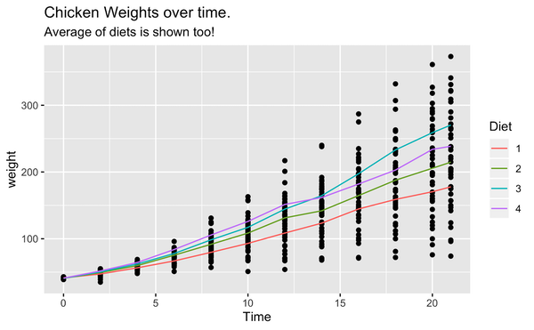

---

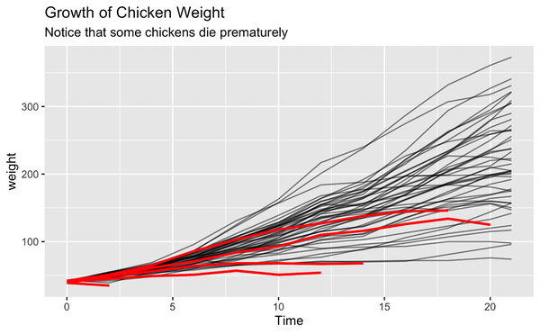

---

## ML Metrikleri vs. İş Metrikleri

| Odak | Model Metriği (Öğrenci Yaklaşımı) | İş Metriği (Mühendis Yaklaşımı) |
| :--- | :--- | :--- |
| **Öneri Sistemi** | Precision, Recall, F1-Score | Tıklama Oranı (CTR), Sepete Ekleme |
| **Churn (Kayıp) Tahmini** | AUC-ROC, Accuracy | Kurtarılan Müşteri Sayısı, Gelir Artışı |
| **Fiyat Optimizasyonu** | RMSE, MAE | Kar Marjı, Satış Hacmi |

---

## Yanlış Problemi Doğru Çözmek

- Eğer sisteminiz kullanıcı için çok yavaşsa, API yanıt süreniz 5 saniyeyi buluyorsa veya şirket için hiçbir finansal değer üretmiyorsa, modelinizin **%99 doğruluk oranına (accuracy)** sahip olması hiçbir şey ifade etmez.

* Basit modelleri denemeden önce derin öğrenmeye geçmek. Ceviz kırmak için balyoz kullanmayın.

---

## Problemi Anlamak: Konu Özeti

- ML bir amaç değil, iş değerine ulaşmak için bir araçtır.
- Başarı, Kaggle'daki gibi sadece doğruluk oranıyla değil, işe kattığı değerle ölçülür.
- Karmaşık bir çözüm üretmeden önce her zaman problemin kök nedenini sorgulayın.

---

# 2. Veriyi Anlamak

---

## Öğrencilik vs Meslek

- **Eğitim:** Veri temizdir, eksiksizdir ve size güzel bir `.csv` dosyası ile sunulur.
* **Gerçek Dünya:** Veri dağınıktır. Veri ambarlarına, farklı API'lara ve ilişkisel veritabanlarına dağılmış durumdadır. İçinde hatalar, eksikler ve anormallikler barındırır.
* **Altın Kural:** *Garbage in, garbage out.* (Çöp girer, çöp çıkar). Modeliniz sadece beslediğiniz veri kadar zekidir.

---

## Veri Sızıntısı (Data Leakage)

_Modele, tahmin etmeye çalıştığı hedef hakkında yanlışlıkla "gelecekten" veya test setinden bilgi sızdırmaktır._

* **Örnek:** Kredi onayı tahmin modelinde, müşterinin "gecikme faizi" verisini kullanmak. (Zaten kredi almış ve geciktirmiş birinin verisidir, onay anında bu veri yoktur!)
* **Sonuç:** Notebook'ta %99 başarı, prodüksiyonda tam bir fiyasko.

---

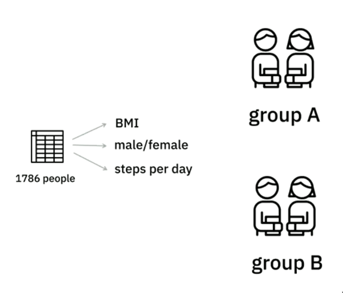

---


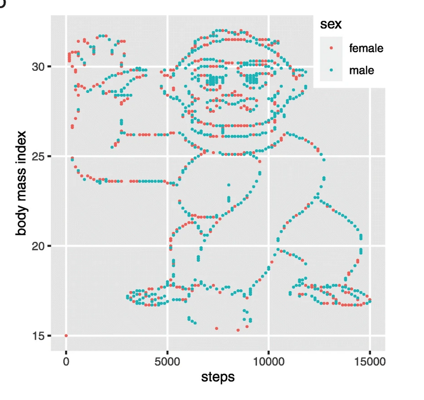

---

# 3. Model Seçimi ve Tasarımı

---

## İş İçin Doğru Aracı Seçmek

Problemi ve veriyi gerçekten anladığınızda, kullanmanız gereken model mimarisi kendiliğinden ortaya çıkar. 

**Sık yapılan hata:** Sırf popüler olduğu için en karmaşık Derin Öğrenme modelini kullanmak.

---

## Sadelik Her Zaman Kazanır

Bazen basit bir Lineer yada Lojistik Regresyon modeli, problemin tam olarak gerektirdiği şeydir.

- Daha hızlı eğitilir.
- Daha az maliyet gerektirir.
- Neden o kararı verdiğini açıklamak (Explainability) çok daha kolaydır.

---

$$\text{predict}(x) = \begin{cases} \text{class}_A & \text{if } p(x) \leq 0.5 \\ \text{class}_B & \text{if } p(x) > 0.5 \end{cases}$$

---

$$\text{predict}(x) = \begin{cases} \text{class}_A & \text{if } p(x) \leq 0.9 \\ \text{class}_B & \text{if } p(x) > 0.9 \end{cases}$$

---

$$\text{predict}(x) = \begin{cases} \text{class}_A & \text{if } p(x) \leq 0.2 \\ \text{class}_B & \text{if } p(x) > 0.8 \\ \text{tahmin etme} & \text{aksi halde} \end{cases}$$

---

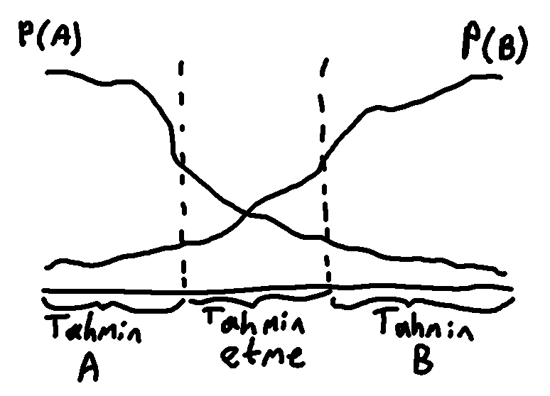

---

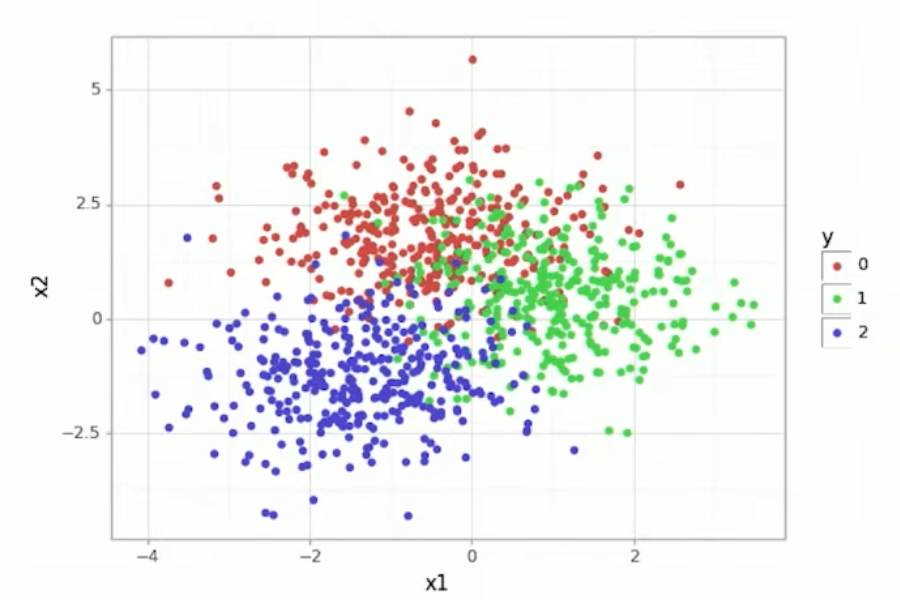

---

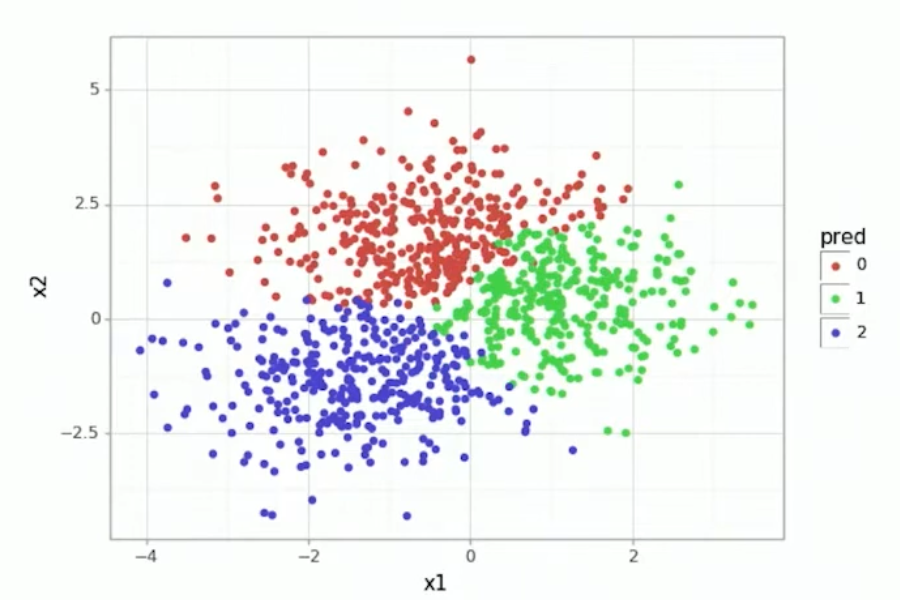

---

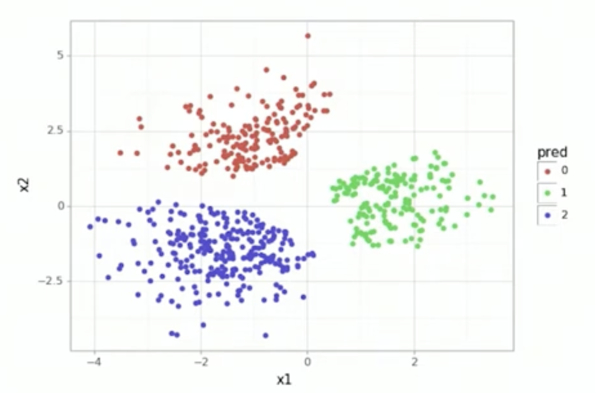

---

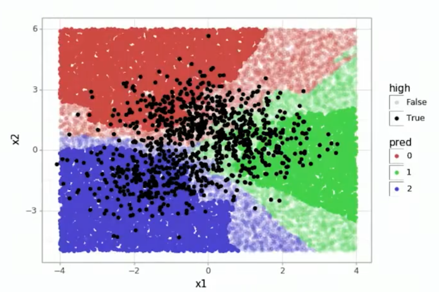

---

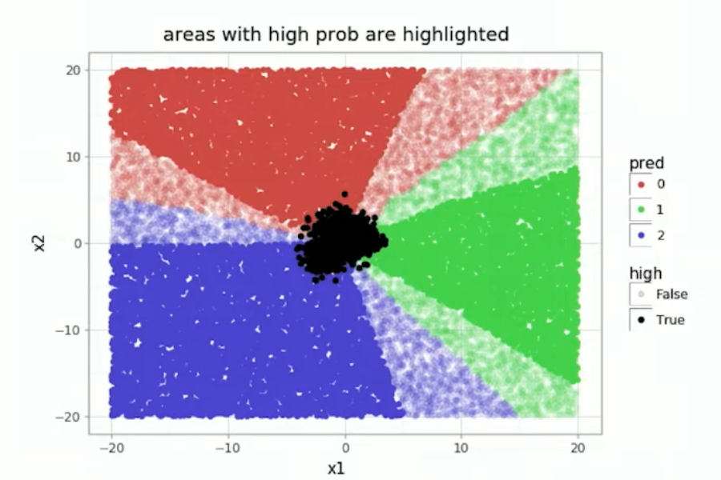

---

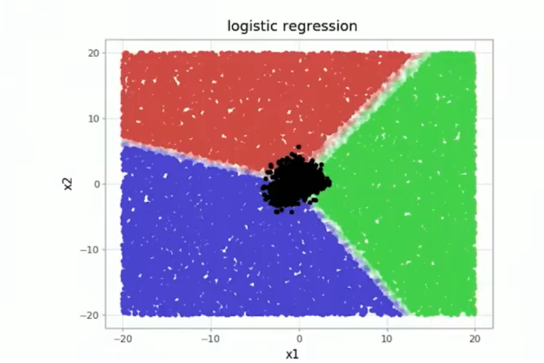

---

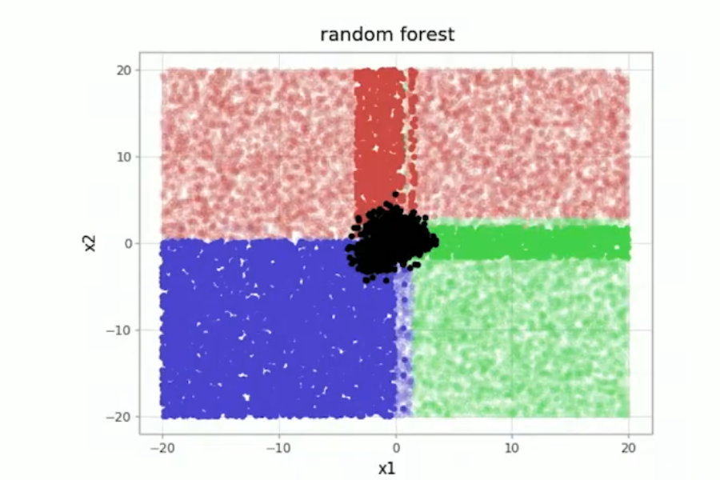

---

```python
out = GaussianMixture(3).fit(X)
boundary = np.quantile(out.score_samples(X), 0.01)
```

---

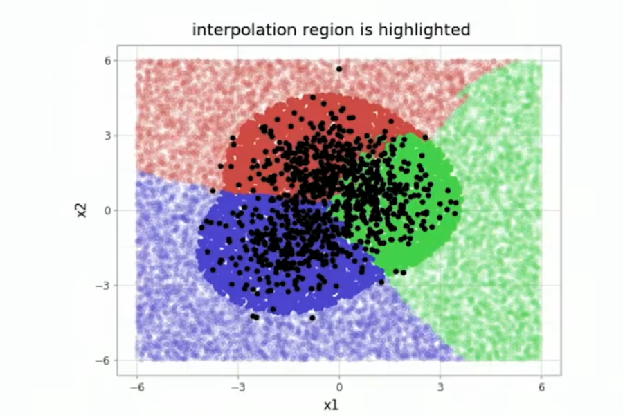

---

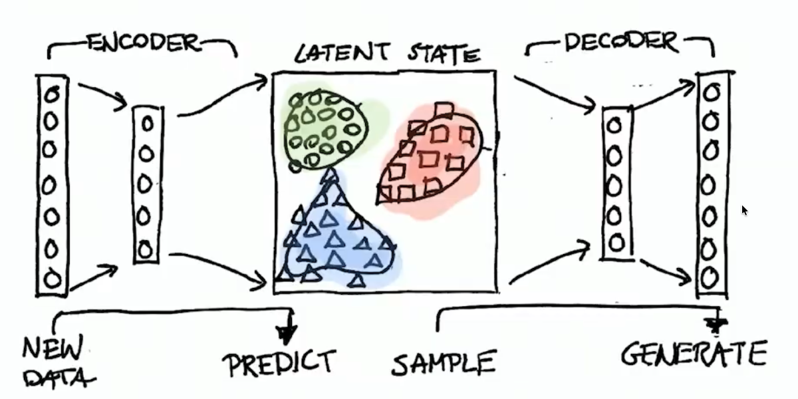

---

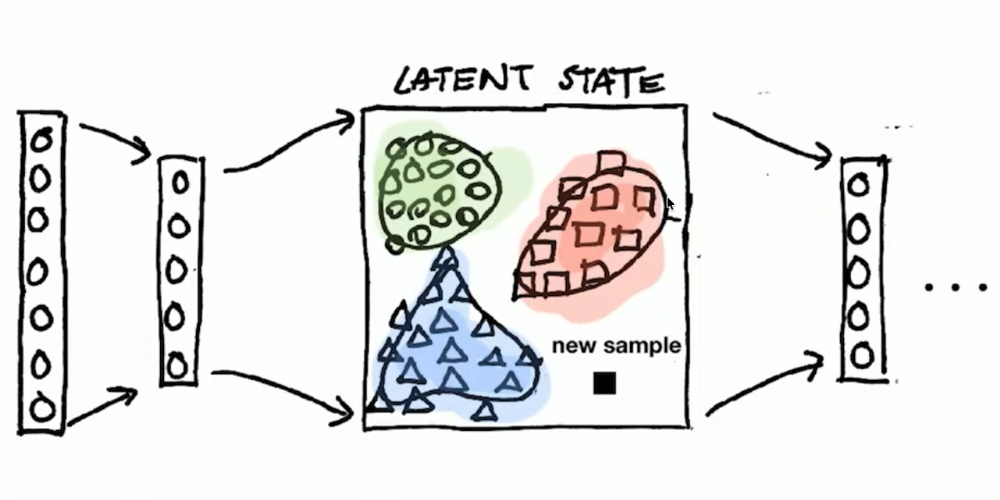

---

# 4. Prototipten Prodüksiyona

---

## Genel sorun

- Bir algoritma lokal ortamındaki Jupyter Notebook üzerinde çalışabilir. Ancak o kod parçası prodüksiyon sunucusuna (canlı ortama) girdiği an patlayabilir.
- Kütüphane sürümleri uyuşmaz, bellek yetmez, yollar (path) kırılır.

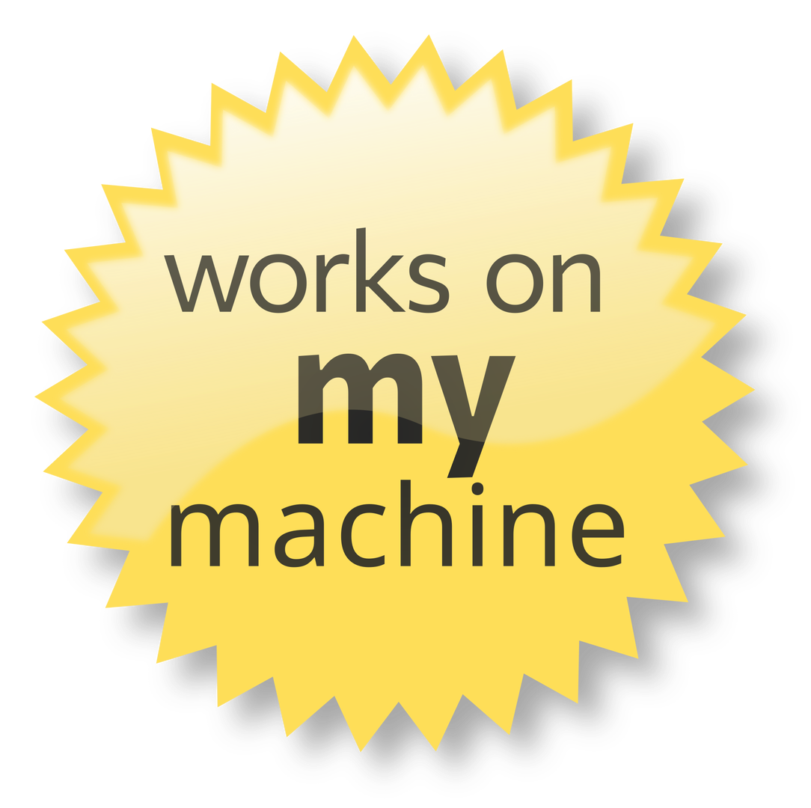

---

## Çözüm: Konteynerizasyon

- **Docker:** Kodunuzu, Python sürümünüzü ve tüm bağımlılıkları izole bir ortam içinde paketleyen bir nakliye konteyneridir.
**("Benim bilgisayarımda çalışıyordu" bahanesini ortadan kaldırır.)**

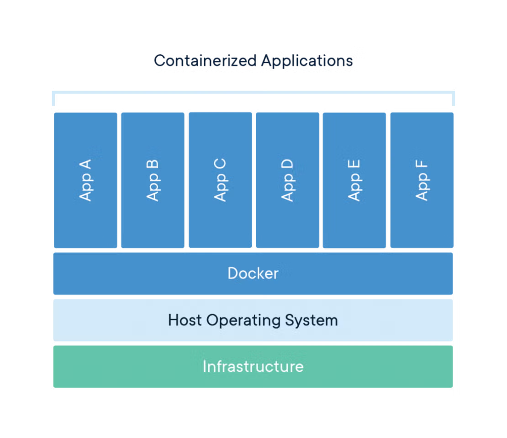

---

## Modeli API Olarak Sunmak

Modelinizi eğittiniz, peki yazılım ekibi (Mobil/Web) bunu nasıl kullanacak? 

Modelinizi bir REST API'nin (örneğin FastAPI veya Flask) arkasına koymalısınız. Gelen JSON verisini alır, modelden geçirir ve sonucu geri döndürürsünüz. 

---

# 5. Model ve Veri Takibi (Monitoring)

---

## Modeller "Yaşayan" Sistemlerdir

- Geleneksel yazılım siz kodunu değiştirene kadar hep aynı şekilde çalışır.
* ML modelleri canlıya çıktığı an yaşlanmaya başlar. Gerçek dünya dinamik olduğu için zamanla fark edilmeden performans kaybederler.

---

<!-- _class: default -->

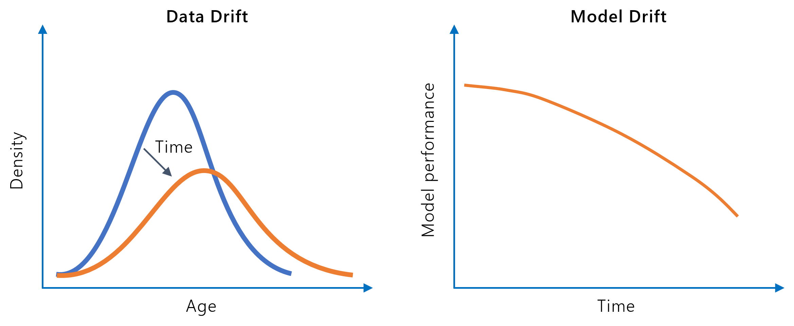

---

## Neden Performans Düşer?

- **Konsept Kayması (Concept Drift):** Hedef (bağımlı) değişkenin doğası değişir.
- **Veri Kayması (Data Drift):** Girdi verisinin dağılımının zamanla değişmesidir.

$y=mx+b$

---

# 6. Kariyer Tavsiyeleri
---

## Baştan Sona Değer Üretin

Artık şirketler sadece "veri setini verin, model eğiteyim" diyen profiller aramıyor. 

Sadece sınıflandırma yapan bir notebook dosyası yeterli değil. Ham veriyi çeken, modeli eğiten, Dockerize eden ve bunu bir API olarak sunan **uçtan uca (end-to-end)** portföy projeleri geliştirin.

---

## Yazılım Mühendisliği Temelleri Şarttır

Bir ML mühendisi, aynı zamanda iyi bir yazılımcı olmalıdır.

- Python'da ustalaşın (OOP, dataclasses vs.).
* Git ve GitHub/GitLab kullanmayı bir refleks haline getirin.
* Temiz, okunabilir ve modüler kod (Clean Code) yazmayı öğrenin.
* Döküman okumayı adet haline getirin.

---

## Paydaşların Dilinden Konuşun

Yöneticiler, ürün sahipleri veya pazarlama ekipleri `Log-Loss` veya `F1-Score` metrikleriyle ilgilenmez.

Toplantılarda teknik jargonda boğulmak yerine şu sorulara cevap verin:
* *"Bu model bize ne kadar zaman/para kazandırdı?"*
* *"Sistem yeterince hızlı ve sonuçları güvenilir/açıklanabilir mi?"*

---

## Sizi Neler Bekliyor

* Veri inceleme/temizleme
* Başka bir ekiple anlaşamadığınız için gece 3:05'de manuel işlem yapma
* İçeride kullanılan legacy kod üzerinde geliştirmeler yapmak
* Satış, Finans ve Pazarlama ekibi için sürekli rapor tabloları hazırlamak
* Önemli bir isteğin ya da kısıtlamanın sonradan paylaşılması

---

## Soru - Cevap

### Dinlediğiniz İçin Teşekkürler!

**Bana Ulaşın:**
- LinkedIn: [in/berkmonder](https://linkedin.com/in/berkmonder) 
- GitHub: [berkmonder](https://github.com/berkmonder)
- Teknasyon Kariyer Fırsatları: [teknasyon.com/career](https://teknasyon.com/career)


---

<style scoped>
li {
  font-size: 16px;
}
li:nth-child(3) strong { color: green; }
</style>

#### ML|Code|Math
- [Coding with Notch (from Minecraft: The Story of Mojang)](https://www.youtube.com/watch?v=BES9EKK4Aw4)
- [tony - Windows to Linux Survival Guide (2027 Edition)](https://www.youtube.com/watch?v=YTgCNB5109Q)
- [3Blue1Brown - The essence of calculus](https://www.youtube.com/watch?v=WUvTyaaNkzM&list=PLZHQObOWTQDMsr9K-rj53DwVRMYO3t5Yr)
- [Artem Kirsanov - Differential Equations: The Language of Change](https://www.youtube.com/watch?v=vTTlzmCRwU4)
- [Coderized - Never install locally](https://www.youtube.com/watch?v=J0NuOlA2xDc)
- [Tom Delalande - The cloud is over-engineered and overpriced (no music)](https://www.youtube.com/watch?v=jFrGhodqC08)
- [PyData - Vincent D Warmerdam](https://www.youtube.com/watch?v=dE5j6NW-Kzg&list=PLbQu-j3EyJfrVBJ09Wh7N8sV_qVzME-WV)
- [CalmCode - A uv trick *from within* Python](https://www.youtube.com/watch?v=_JfllY6oNF8)
- [CalmCode Website](https://calmcode.io/)
- [marimo - marimo in 100 seconds](https://www.youtube.com/watch?v=3dUagnSKaA8)
- [O'Reilly - I don't like notebooks.- Joel Grus (Allen Institute for Artificial Intelligence)](https://www.youtube.com/watch?v=7jiPeIFXb6U)
- [StatQuest with Josh Starmer - The Main Ideas of Fitting a Line to Data (The Main Ideas of Least Squares and Linear Regression.)](https://www.youtube.com/watch?v=PaFPbb66DxQ)
- [Andrej Karpathy - How I use LLMs](https://www.youtube.com/watch?v=EWvNQjAaOHw)
- [Algorithmic Simplicity - THIS is why large language models can understand the world](https://www.youtube.com/watch?v=UKcWu1l_UNw)
- [PewDiePie - I Trained My Own AI... It beat ChatGPT](https://www.youtube.com/watch?v=aV4j5pXLP-I)
- [Carson Gross - Yes, and...](https://htmx.org/essays/yes-and/)
#### Bonus
- [Veritasium - What is NOT Random?](https://www.youtube.com/watch?v=sMb00lz-IfE)
- [Vsauce - Which Way Is Down?](https://www.youtube.com/watch?v=Xc4xYacTu-E)
- [Physics Videos by Eugene Khutoryansky - Entropy is not disorder: micro-state vs macro-state](https://www.youtube.com/watch?v=vX_WLrcgikc)
